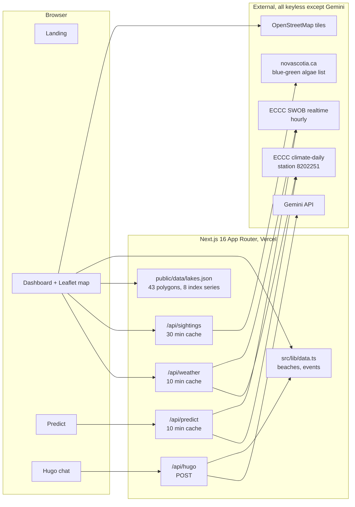

# ShoreCheck

**Halifax beach water quality, a rain-driven prediction you can score against the lab, and a satellite watch on the lakes nobody tests.**

ShoreCheck is a Next.js 16 app built at a Halifax hackathon. It puts four dated signals about swimming water on one dark, quiet page, and it refuses to blur them into a single "safe / unsafe" verdict. Every number on screen carries the timestamp it was taken at, because the whole point is that the signals move at different speeds: a lab sample is a weekly ruling, a weather station updates hourly, a satellite looks down every ten days if the sky is clear, and a cyanobacteria bloom can surface in two or three.

Live: deploy from this repo on Vercel. Repo: `github.com/PriyanArora/shorecheck`.

---

## What it does

| Page | What you get |
|---|---|
| `/` | Video hero, the four signals as a bento, and a plain-language note on sources, cadence and caveats. |
| `/dashboard` | Official status at 12 supervised HRM beaches, a monochrome Leaflet map with beach markers and lake outlines, the full results table, the lake watch cards, and events nearby. |
| `/predict` | Press a button, get a predicted status per water type from 48-hour rainfall, then watch the model score itself against every official sample, beach by beach and day by day. |
| `/hugo` | Hugo, a Gemini-backed local who answers only from the same beach and event data the map uses. |
| `/trees` | A teammate's tree-hazard screening tool, embedded in place. |

### The four signals, and why they are kept apart

1. **Official tests.** HRM samples supervised beaches weekly, July 1 to August 31. E. coli for lakes, Enterococci for the ocean. This is the only signal that is a ruling. Everything else is context.
2. **Prediction.** Beach bacteria follow runoff, so the model is deliberately naive: rainfall over the last 48 hours at Halifax Stanfield, thresholded per water type. Lake beaches go to advisory at 10 mm and closed at 25 mm; ocean at 15 and 35. It is recomputed for the day each beach was sampled and compared with the lab result, so the page shows its own hit rate rather than asking you to trust it.
3. **Lake watch.** 43 named HRM lakes with OpenStreetMap polygons. Eight have a Sentinel-2 index series, pre-pulled and shipped as static JSON. Each lake card shows the date of the last clear look, how many days ago that was, the number of clear looks in the last 30 days, a sparkline, and whether the index is rising, flat or falling across the last three looks.
4. **Bloom conditions.** The province's stated trigger for cyanobacteria blooms is "a period of hot, dry weather followed by heavy rainfall". We evaluate that as a rule against the same weather feed and surface it two ways: a regional label on the dashboard, and a per-lake badge that says whether the sequence has occurred *since that lake's last clear satellite look*. It is context about how stale the look is, not a prediction.

### Words we do not use

`safe`, `unsafe`, `current`, `real-time`, `toxic`, `bloom detected`. The satellite index is unvalidated and the footer of every lake card says so. Nothing is interpolated between satellite passes.

---

## Architecture



### Layers

**Route handlers** (`src/app/api/*/route.ts`) are plain App Router `GET`/`POST` functions returning `Response.json`. Each keeps a module-level cache with a timestamp, which is the whole caching strategy: cheap, honest, and it survives a cold start by simply refetching.

- `weather` fetches 16 days of daily rows from Environment and Climate Change Canada's `climate-daily` collection plus the latest SWOB hourly observation, drops rows with null precipitation (the last one or two days usually lag), and returns the bloom label, `rain48`, the dry run before the last rain, the max temperature over that run, and the raw day rows so the client can evaluate per-lake rules.
- `sightings` fetches the province's blue-green algae page with a real User-Agent, finds the text "reported in 2026", parses the first `<table>` after it, and returns `{checkedAt, parsed, entries}`. If the page cannot be parsed the UI says "list checked HH:MM, could not parse" rather than pretending.
- `predict` builds one prediction per complete weather day, joins each beach's sample date to that day, and reports matches, misses, and a percentage over the beaches that can be scored. Beaches whose season is over are shown but not scored.
- `hugo` sends the beach and event tables to Gemini as a system instruction with a short rule set, and asks the model to end with `BEACH: <id>` when it recommends one, which the client turns into a card. If the key is missing or the call fails, the chat falls back to a keyword matcher over the same data.

**Pure logic** lives in `src/lib`:

- `weather.ts`: ECCC fetchers, `rain48Now`, `bloomConditions`, and the rule-based `favourableDays` / `conditionsSince`.
- `predict.ts`: thresholds, `predictStatus`, and the sample-date parser.
- `lakes.ts`: the `Lake` type, the JSON loader, `daysSince`, `clearLooks30d`, `indexTrend`, and the case-insensitive matcher that ties a provincial list entry to a lake by name minus the word "Lake".

**UI** is React 19 with Tailwind 4, shadcn/ui (Card, Badge, Separator, Skeleton, Table, Button, Sheet) and three Aceternity-style pieces written by hand: a bento grid, a spotlight, and a word-by-word text reveal on `motion`. The map is react-leaflet 5 over OpenStreetMap tiles pushed to black and grey with a CSS filter, so it needs no tile key. Lake polygons render as `GeoJSON` layers: white stroke for a series within its own baseline, amber for an unvalidated anomaly, dashed grey for lakes with no series. Status is always shape plus colour plus a word, never colour alone.

**Type and theme.** SF Pro on Apple devices, Inter elsewhere, on a `#000` ground with `#1d1d1f` cards and `#86868b` secondary text. No mono, no tracked uppercase labels, hairline separators, 22 px radii, 200 ms ease-out transitions.

---

## The satellite index

Shipped in `public/data/lakes.json` and never recomputed at runtime.

- **Source:** Sentinel-2 L1C via the Copernicus Data Space Ecosystem Statistical API. L2A was rejected because roughly a third of observations came back with negative reflectance over these small dark lakes.
- **Index:** `max(MCI, FAI)` per scene, lake median over a 60 m inward buffer to keep shoreline pixels out.
- **Measurability:** 641 of 1,363 named HRM lakes have at least 25 interior 20 m pixels. Oat Hill, Penhorn and Elbow do not, and the card says "too small for satellite".
- **Flag rule:** last value above the lake's own baseline, median plus 3 times 1.4826 times MAD, with a floor of 0.002.
- **Cadence:** median 10 days between clear looks per lake. Most lakes were last seen clearly on 2026-08-30, Lake Echo on 2026-09-11.
- **Validation:** none worth claiming. Backtest hit rate 3 of 28 against reported blooms, false alarm rate 0.06. The UI says "unvalidated" on every card.

### What we found when we tried to do better

We asked whether the province's weather trigger could bridge the gap between satellite passes, and whether that could be given a number. It cannot, and we checked three ways:

1. **Recall against the base rate.** Over the 2023 to 2025 summers the rule fired before 31 of 41 reported lake-months. But reports are month-dated, and a trigger fell inside 10 of those 12 months, so at that resolution the flag is almost always on and recall means little.
2. **Bayes.** Lake-months with a trigger had a reported bloom 7.2% of the time; lake-months without, 11.6%. No lift.
3. **Satellite index as the outcome.** 647 clear looks across the eight lakes, May to October 2021 to 2026. Looks within ten days of a trigger were above baseline 8.7% of the time; other looks 8.0%. Relative risk 1.09, Fisher exact p = 0.49. The rank correlation between rain in the five days before a look and the index is slightly negative.

So the badge stays what it is: a note that the last look is stale relative to a weather event. Day-dated bloom reports, or HRM's weekly cyanobacteria beach checks as a source of true negatives, would make a real model possible. Positive-unlabeled learning (Elkan and Noto, 2008) is the right tool once that exists.

---

## Running it

```bash
npm install
cp ../.env .env.local        # or create .env.local with GEMINI_API_KEY=...
npm run dev                  # http://localhost:3000
npm run lint
npm run build
```

Environment:

| Variable | Needed for | Notes |
|---|---|---|
| `GEMINI_API_KEY` | `/api/hugo` | Without it Hugo silently uses the keyword fallback. |
| `GEMINI_MODEL` | optional | Defaults to `gemini-3.6-flash`. |

Everything else is keyless: ECCC GeoMet, the province page, OpenStreetMap tiles, and the static lake JSON. No Copernicus credentials are needed to run the app; the satellite pull was done once, offline, in `../feasibility`.

Deploy on Vercel by importing the repo and setting `GEMINI_API_KEY`. The build is a standard `next build`; all pages are static except the four route handlers.

---

## Data sources and licences

| Source | Used for | Licence |
|---|---|---|
| Halifax Regional Municipality beach sampling | Official beach status and results | Public information, reproduced as published |
| Environment and Climate Change Canada, GeoMet OGC API, station Halifax Stanfield 8202251 | Daily and hourly weather | [Open Government Licence – Canada](https://open.canada.ca/en/open-government-licence-canada) |
| Nova Scotia Environment, blue-green algae reports | Reported sightings per lake | Crown copyright, reproduced as published |
| Copernicus Sentinel-2 L1C via the Copernicus Data Space Ecosystem | Lake index series | [Copernicus Sentinel data licence](https://sentinels.copernicus.eu/documents/247904/690755/Sentinel_Data_Legal_Notice), free, full and open; contains modified Copernicus Sentinel data 2021 to 2026 |
| OpenStreetMap via Overpass | Lake polygons | [ODbL 1.0](https://opendatacommons.org/licenses/odbl/), © OpenStreetMap contributors |
| OpenStreetMap standard tiles | Map basemap | [OSMF tile usage policy](https://operations.osmfoundation.org/policies/tiles/) |
| Google Gemini | Hugo's replies | Google API terms; your key, your usage |

Lake polygons are a derived database under ODbL; the GeoJSON in `public/data/lakes.json` carries the OSM attribution and is shared under the same terms.

## Licence

The ShoreCheck code is released under the [MIT Licence](./LICENSE). The data files under `public/data` keep the licences of their sources listed above.

---

## Credits

Built by Priyan Arora and Aaryan Kapoor at a Halifax hackathon, with the tree-hazard screening tool by a teammate embedded on `/trees`. The lake-watch feasibility work, including the Copernicus quota accounting, the L1C versus L2A comparison, and the backtests, lives in the sibling `feasibility/` folder and is summarised in its `VERDICT.md`.
